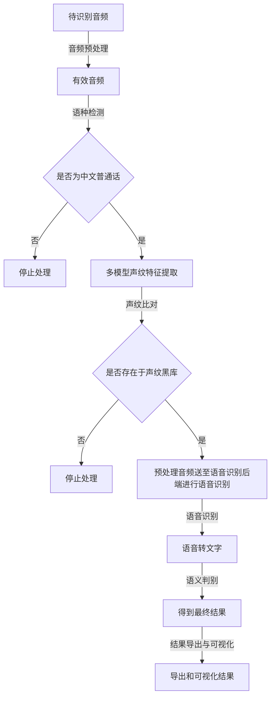

## 1. 处理流程

第一步：音频预处理
用户将待识别的音频文件通过post请求上传至服务端，并进行音频预处理，包括音频格式转换、通道选取、时长选取、重采样至8k、以及VAD操作提取有效音频。如果有效音时长小于阈值，则停止处理。

第二步：语种检测
经过音频预处理后，从有效音频中对语种进行分类，如果检出结果不是中文普通话（置信度>70%）则停止处理。

第三步：声纹提取与比对
满足语种检测要求后，对有效音频进行多模型声纹特征提取。将各模型特征与该模型对应的声纹黑库进行比对，得到各模型的比对结果。如果各模型比对结果均大于阈值，且top1的黑库ID相同，则认为该音频为该黑库的声纹，否则认为该说话人不存在于黑库中。

第四步：语音识别
对于认为存在于声纹黑库中的说话人，将其预处理后音频送至语音识别后端进行语音识别。

第五步：语义判别
将语音识别的结果送至语义判别后端进行语义判别，得到最终结果。

第六步：结果导出与可视化
将各模块的处理结果进行导出与可视化，包括结果的导出和可视化等操作。
    

